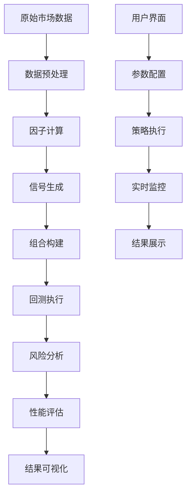

# 技术架构文档

## 1. 系统架构概览

### 1.1 核心组件

```
A股量化策略研究平台
├── 数据层 (Data Layer)
│   ├── 原始数据文件 (data/*.csv, *.json)
│   ├── 归档系统 (data/archive/)
│   └── 缓存机制 (@st.cache_data)
├── 业务逻辑层 (Business Logic)
│   ├── 因子计算引擎 (Factor Engine)
│   ├── 策略回测引擎 (Backtesting Engine)
│   ├── 风险管理模块 (Risk Management)
│   └── 性能分析模块 (Performance Analytics)
├── 表示层 (Presentation Layer)
│   ├── Streamlit Web界面 (app/streamlit_app.py)
│   ├── 交互式图表 (Plotly可视化)
│   └── 响应式UI组件
└── 基础设施层 (Infrastructure)
    ├── 日志系统 (双重日志记录)
    ├── 测试框架 (E2E Testing)
    ├── CI/CD流水线 (GitHub Actions)
    └── 容器化部署 (Docker)
```

### 1.2 数据流架构



## 2. 核心模块详解

### 2.1 数据管理系统

#### 文件组织结构
- **原始数据**: `data/` 目录下的CSV和JSON文件
- **归档数据**: `data/archive/` 按类型分类存储
- **缓存机制**: Streamlit缓存装饰器优化读取性能

#### 数据安全策略
```python
def _glob_exclude_archive(pattern: str, exclude_dirs: list = None) -> list:
    """安全的文件搜索，排除归档目录"""
    if exclude_dirs is None:
        exclude_dirs = ['archive']
    all_files = list(DATA_DIR.glob(pattern))
    filtered_files = []
    for file_path in all_files:
        if not any(part in exclude_dirs for part in file_path.parts):
            filtered_files.append(file_path)
    return filtered_files
```

### 2.2 缓存与状态管理

#### Streamlit缓存策略
- `@st.cache_data`: 数据文件读取缓存
- `ttl`: 时间生存期控制
- `show_spinner`: 用户体验优化

#### 状态持久化
- 会话状态管理 (`st.session_state`)
- 参数配置持久化
- 计算结果缓存

### 2.3 UI状态与交互设计

#### 标签页架构
1. **总览 (Overview)**: 策略性能总览和关键指标
2. **网格分析 (Grid Analysis)**: 参数优化和敏感性分析
3. **个股查询 (Stock Query)**: 单一标的深度分析
4. **执行画像 (Execution Profile)**: 策略执行统计和画像分析

#### 响应式设计
- 简洁模式与高级模式切换
- 可折叠参数配置区域
- 动态图表更新机制

## 3. 算法与计算引擎

### 3.1 因子计算框架

#### 动量因子计算
```python
# 价格动量
momentum_1m = (current_price / price_1m_ago) - 1
momentum_3m = (current_price / price_3m_ago) - 1

# 波动率制度识别
volatility_regime = calculate_volatility_regime(returns, window=252)
```

#### 波动率制度分类
- **低波动率制度**: VIX < 20或历史波动率 < 15%
- **高波动率制度**: VIX > 30或历史波动率 > 25%
- **中等波动率制度**: 介于两者之间

### 3.2 策略回测引擎

#### Fama-MacBeth两步法回归
1. **第一步**: 时间序列回归，估计个股因子暴露
2. **第二步**: 截面回归，计算因子风险溢价

#### 性能指标计算
- **Information Coefficient (IC)**: 信息系数
- **Information Ratio (IR)**: 信息比率
- **最大回撤**: 策略风险控制指标
- **夏普比率**: 风险调整后收益

### 3.3 风险管理模块

#### 换手率控制
- 目标换手率: 23-70%区间
- 交易成本模型: 线性成本函数
- 容量约束: 大资金适用性分析

#### 风险分解
- 行业风险暴露
- 风格因子风险
- 特异性风险控制

## 4. 性能优化

### 4.1 计算性能优化

#### 数据读取优化
- 缓存机制减少I/O操作
- 增量计算避免重复运算
- 并行处理提升计算效率

#### 内存管理
- 大文件分块处理
- 及时释放无用对象
- Pandas内存优化技巧

### 4.2 用户体验优化

#### 加载性能
- 进度条显示计算进度
- 异步加载长时间任务
- 缓存热点数据

#### 交互响应
- 防抖动处理用户输入
- 智能默认参数设置
- 错误处理与用户提示

## 5. 监控与日志

### 5.1 日志系统架构

#### 双重日志记录
```python
# 文件日志
file_handler = logging.FileHandler('logs/app.log')
# 控制台日志
console_handler = logging.StreamHandler()

logger.addHandler(file_handler)
logger.addHandler(console_handler)
```

#### 日志级别管理
- **INFO**: 正常业务流程记录
- **WARNING**: 潜在问题提醒
- **ERROR**: 错误异常记录
- **DEBUG**: 开发调试信息

### 5.2 性能监控

#### 关键指标监控
- 页面加载时间
- 计算执行时间
- 内存使用情况
- 缓存命中率

## 6. 部署与运维

### 6.1 容器化部署

#### Docker配置
```dockerfile
FROM python:3.12-slim
WORKDIR /app
COPY requirements.txt .
RUN pip install -r requirements.txt
COPY . .
EXPOSE 8501
HEALTHCHECK --interval=30s --timeout=30s --start-period=5s --retries=3 \
    CMD curl -f http://localhost:8501/_stcore/health
CMD ["streamlit", "run", "app/streamlit_app.py"]
```

### 6.2 CI/CD流水线

#### 自动化流程
1. 代码质量检查 (Black, isort, flake8)
2. 类型检查 (mypy)
3. 单元测试执行 (pytest)
4. 安全扫描 (bandit, safety)
5. 容器构建与测试
6. 文档自动生成

## 7. 扩展性设计

### 7.1 模块化架构
- 松耦合组件设计
- 插件化因子框架
- 策略模板系统

### 7.2 数据源扩展
- 多数据源适配器
- 实时数据接入接口
- 外部API集成框架

## 8. 安全考虑

### 8.1 数据安全
- 敏感数据脱敏处理
- 访问权限控制
- 数据备份与恢复

### 8.2 系统安全
- 容器安全扫描
- 依赖漏洞检测
- 运行时安全监控

---

**最后更新**: 2025-09-25
**文档版本**: v1.0
**维护者**: Quant Research Team